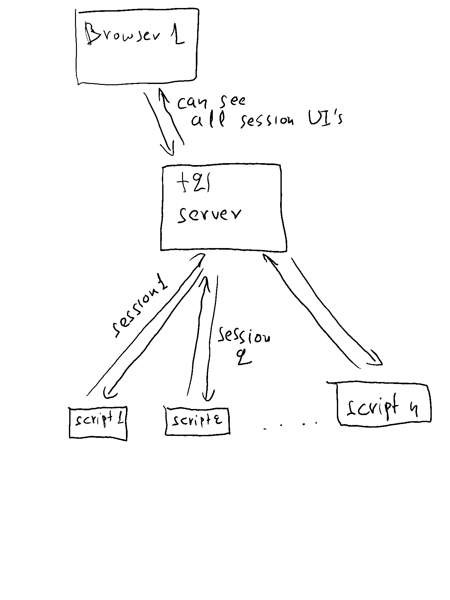

Note: for Table Of Contents, just click the burger icon top right of this document, just above this text on the right.


# Terminal 21

Scala terminal apps for the 21st century.

Terminal 21 is a library and server that give scala command line programs (i.e. scala-cli scripts) the ability to easily
create web user interface (which is based on react and components like chakra etc). This interfaces can display information
but also react to onClick and onChange events, all which will be handled in the scala code. 
See a couple of quick presentations
of what can be done at the [terminal 21 youtube channel](https://www.youtube.com/@terminal21-gf1oh/videos).

For scala 3 and jdk21 or better. If you have scala-cli installed, you won't need to download scala 3 or jdk21, see below for instructions on how to quickly start with terminal21.

Note: feel free to ask questions in the [Discussions board](https://github.com/kostaskougios/terminal21-restapi/discussions).

# Quick start with terminal21

The easiest way to start with terminal21 is to clone this repository. There is a [scala-cli script that starts the server](example-scripts/server.sc)
(all deps and jdk21 will be downloaded automatically by scala-cli).

```shell
git clone https://github.com/kostaskougios/terminal21-restapi.git
cd terminal21-restapi/example-scripts

# start the server
./server.sc
# ... it will download dependencies & jdk and start the server.
```
Now open your browser to http://localhost:8080/ui/ . You'll have the terminal21 UI, will be a bit empty for now, just the settings tab. But we will shortly run some scripts with UI's.

Let's run some example scripts. All scripts use [project.scala](example-scripts/project.scala) with some common settings and dependencies.

Start with a hello world example:

[hello-world.sc](example-scripts/hello-world.sc)

Run it
```shell
./hello-world.sc
```

and check your browser. Changes in the terminal21 UI will reflect instantly.

And then continue with a more complicated csv editor:

[csv-editor.sc](example-scripts/csv-editor.sc) : edit csv files.

```shell
./csv-editor.sc -- /tmp/wargame.csv
```
(note the "--": this is a scala-cli parameter needed before passing actual arguments to a script. The actual argument is the csv filename.)

Terminal21 UI will now have the csv editor's tab:


If we click in a cell, we will be able to change a value. And then use the "Save & Exit" button to save the file and exit.


Now feel free to examine and run the rest of the scripts or create your own! You can have the server running and develop your
scripts with your favorite IDE. Run the scripts within the IDE and view the UI in a browser.

# Tutorial

To learn the basics of coding with terminal21, please see the [tutorial](docs/tutorial.md)

# Example scripts

```shell
ls *.sc
bouncing-ball.sc   csv-editor.sc      csv-viewer.sc      hello-world.sc     mathjax.sc         nivo-line-chart.sc postit.sc          server.sc          textedit.sc
```

Let's create a simple hello world script in scala-cli that uses terminal21 server to render the UI.

[hello-world.sc](example-scripts/hello-world.sc)
```scala
import org.terminal21.client.*
import org.terminal21.client.components.*

Sessions.withNewSession("hello-world", "Hello World Example"): session =>
  given ConnectedSession = session
  Seq(
    Paragraph(text = "Hello World!")
  ).render()
  session.waitTillUserClosesSession()
```

If we run this, then we can point our browser to the server, and we will see this UI:


The script will wait until the user clicks the close button, which then will invalidate the
session it has with the server and terminate the app. 


# Usecases

Due to its client-server architecture, terminal21 gives a UI to scripts running i.e. on servers without a desktop environment and
can be used for things like:
- creating text file editors which run on desktop-less servers but still allows us to edit the text file on our browser, see [textedit.sc](example-scripts/textedit.sc)


- creating csv editors and viewers, [csv-editor.sc](example-scripts/csv-editor.sc) and [csv-viewer.sc](example-scripts/csv-viewer.sc)
- messaging apps like [postit.sc](example-scripts/postit.sc)


- even small web based games, maybe starting with [bouncing-ball.sc](example-scripts/bouncing-ball.sc)
- POC code at the office can be presented via a scala-cli script + terminal21 UI. The POC code can be imported as a lib in a script.
- logs can be viewed and searched via scripts


- notebooks with charts like [notebooks](example-scripts/nivo-line-chart.sc) and with maths like  [maths](example-scripts/mathjax.sc)
- spark notebooks like [spark-notebook.sc](example-spark/spark-notebook.sc)

# Available UI Components

Standard html elements
[Std](docs/std.md)

Generic components for buttons, menus, forms, text, grids, tables:
[Chakra](docs/chakra.md)

"Quick" classes to simplify complicated UI's like tables:
[Quick Classes](docs/quick.md)

Charts and visualisation:
[Nivo](docs/nivo.md)

Maths:
[MathJax](docs/mathjax.md)

Spark:
[Spark](docs/spark.md)
# Architecture

Terminal21 consist of :
- a scala/react based web server that can be easily deployed on your laptop, home network etc
- scala apps (scala-cli/ammonite scripts or just normal scala apps) that use the terminal21 UI libs to create user interfaces

The terminal21 libs have a websocket open with the server, and they send / receive instructions and events. Similarly, the server
has a websocket open with the React frontend on the browser to do the same. Events like clicks or changes to input boxes instantly update
the state in the client scripts.



# Mutability

terminal21 ui components are immutable from v0.20. Use `component.withX(...).renderChanges()` to modify a component
and render it. Note that the original `component` is not changed.

Also, when getting a value of i.e. an Input, use `myInput.current.value`. `current` makes sure we read the component with
all changes that may have occurred at the browser and all the changes we did on our script.

# Need help?

Please use the [discussions](https://github.com/kostaskougios/terminal21-restapi/discussions) of the project to post any questions, comments or ideas.

# Changelog

## Version 0.30

- apps can now run on the server + server management bundled apps
- Cookie setter and reader.
- session builders refactoring for more flexible creation of sessions
- QuickTabs, QuickFormControl
- bug fix for old react state re-rendering on new session
- event iterators allows idiomatic handling of events and overhaul of the event handling for easier testing and easier development of larger apps
- MVC

## Version 0.21

- more std and chakra components like Alert, Progress, Tooltip, Tabs.

## Version 0.20

- immutable components
- option to render only changed components

## Version 0.11

- Quick* classes to simplify UI creation
- A few Nivo visualisation components
- spark integration, terminal21 acts as a spark notebook
- ui component documentation

## Version 0.1

- initial release with std and chakra components


# Our thanks


To yourkit for their excellent profiler.

YourKit supports open source projects with innovative and intelligent tools
for monitoring and profiling Java and .NET applications.
YourKit is the creator of [YourKit Java Profiler](https://www.yourkit.com/java/profiler/),
[YourKit .NET Profiler](https://www.yourkit.com/dotnet-profiler/),
and [YourKit YouMonitor](https://www.yourkit.com/youmonitor/).