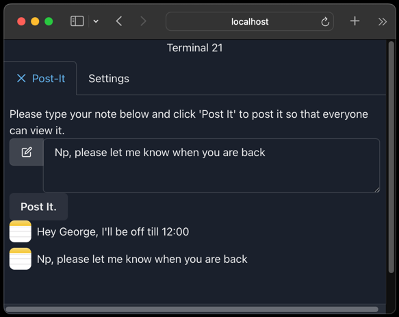

Note: for Table Of Contents, just click the burger icon top right of this document.

# Terminal 21

Terminal 21 is a library and server that give scala command line programs (i.e. scala-cli scripts) the ability to easily
create web user interface (which is based on react and components like chakra etc). See a couple of quick presentations
of what can be done at the [terminal 21 youtube channel](https://www.youtube.com/@terminal21-gf1oh/videos).

For scala 3 and jdk21 or better. If you have scala-cli installed, you won't need to download scala 3 or jdk21, see below for instructions on how to quickly start with terminal21.

Note: feel free to ask questions in the "Discussions" board at the top of this github page.

Terminal21 consist of :
- a web server that can be easily deployed on your laptop, home network etc 
- scala apps (scala-cli/ammonite scripts or just normal scala apps) that use the terminal21 UI libs to create user interfaces

The terminal21 libs have a websocket open with the server, and they send / receive instructions and events. Similarly, the server
has a websocket open with the React frontend to do the same. Events like clicks or changes to input boxes instantly update
the state in the client scripts.

The best and easiest way to start with terminal 21 is via scala-cli and a simple example.

First start the server with a scala-cli script like this (better clone this repository as explained below at [Quick start with terminal21](#Quick start with terminal21) ):

[server.sc](example-scripts/server.sc)

Let's create a simple hello world script in scala-cli that uses terminal21 server to render the UI.

[hello-world.sc](example-scripts/hello-world.sc)
```scala
import org.terminal21.client.*
import org.terminal21.client.components.*

Sessions.withNewSession("hello-world", "Hello World Example"): session =>
  given ConnectedSession = session
  Seq(
    Paragraph(text = "Hello World!")
  ).render()
  session.waitTillUserClosesSession()
```

If we run this, then we can point our browser to the server, and we will see this UI:


The script will wait until the user clicks the close button, which then will invalidate the
session it has with the server and terminate the app. 


# Usecases

Due to it's client-server architecture, terminal21 gives a UI to scripts running i.e. on servers without a desktop environment and
can be used for things like:
- creating text file editors which run on desktop-less servers but still allows us to edit the text file on our browser, see [textedit.sc](example-scripts/textedit.sc)


- creating csv editors and viewers, [csv-editor.sc](example-scripts/csv-editor.sc) and [csv-viewer.sc](example-scripts/csv-viewer.sc)
- messaging apps like [postit.sc](example-scripts/postit.sc)



- even small web based games, maybe starting with [bouncing-ball.sc](example-scripts/bouncing-ball.sc)
- POC code at the office can be presented via a scala-cli script + terminal21 UI. The POC code can be imported as a lib in a script.
- logs can be viewed and searched via scripts
- ... and so on

# Quick start with terminal21

The easiest way to start with terminal21 is to clone this repository. There is a scala-cli
script that starts the server (all deps and jdk21 will be downloaded automatically by scala-cli).

```shell
git clone https://github.com/kostaskougios/terminal21-restapi.git
cd terminal21-restapi/example-scripts

# start the server
./server.sc
# ... it will download dependencies & jdk and start the server.
```
Now open your browser to http://localhost:8080/ui/ . You'll have the terminal21 UI, will be a bit empty for now, just the settings tab. But we will shortly run some scripts with UI's. 

Let's run some example scripts. All scripts use project.scala with some common settings and dependencies.

[csv-editor.sc](example-scripts/csv-editor.sc) : edit csv files.

```shell
./csv-editor.sc -- /tmp/wargame.csv
```
(note the "--": this is a scala-cli parameter needed before passing actual arguments to a script. The actual argument is the csv filename.)

Terminal21 UI will now have the csv editor's tab:


If we click in a cell, we will be able to change a value. And then use the "Save & Exit" button to save the file and exit.


Now feel free to examine and run the rest of the scripts or create your own! I found out MS code works better for scala-cli scripts but
please make sure you include the terminal21 libs in the script rather than in `project.scala`. This will make autocomplete work better.

```shell
ls *.sc
bouncing-ball.sc csv-editor.sc    csv-viewer.sc    hello-world.sc   postit.sc        server.sc        textedit.sc
```

# Architecture

Terminal21 consists of a server (that can easily be started with the provided )
# Mutability

terminal21 ui components are mutable. This is a decision choice (for now) because of how much more simple code is this way. I.e.
changing the text of a paragraph on an event handler is as simple as :

```scala
    p.text = "new text"
```

The equivalent immutable code would be (at least) 
```scala
    p.copy(text= "new text")
```

Also by default some component values (like input boxes) are changed by the user. These changes are reflected in the component graph, something that
would be a lot harder if the graph was immutable.

If there is a reasonable way to refactor to have immutability without compromising simplicity, it will be done.

# Need help?

Please use the discussions of the project to post any questions, comments or ideas.
