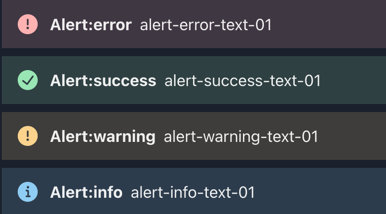
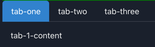

# Chakra components

Chakra components build on top of standard html elements to provide nice UI for text, forms, tables etc.
See [Chakra Components for React](https://chakra-ui.com/docs/components).

These case classes can be used to render chakra components.
[The case classes](../terminal21-ui-std/src/main/scala/org/terminal21/client/components/chakra/ChakraElement.scala)

Note: not all chakra elements are available and also only a fraction of the available properties of each component is documented here.
See the case class for a full list as well as the chakra react documentation (links are available in the scaladocs of each case class).

If you want a chakra component that is not supported yet, please add a comment here: [Chakra support discussion](https://github.com/kostaskougios/terminal21-restapi/discussions/2)

[Examples](https://github.com/kostaskougios/terminal21-restapi/tree/main/example-scripts) 

Dependency: `io.github.kostaskougios::terminal21-ui-std:$VERSION`

### Text

```scala
Text(text = "typography-text-0001", color = Some("tomato"))
```


### Button


```scala
val b = Button(text = "Keep Running")
b.onClick: () =>
    b.withText("Clicked").renderChanges()
```

### Box


```scala
Box(text = "Badges", bg = "green", p = 4, color = "black")
```

## HStack / VStack
Horizontal / Vertical stack of elements


```scala
HStack().withChildren(
  checkbox1,
  checkbox2
)
```

### Menus


```scala
Menu().withChildren(
  MenuButton(text = "Actions menu0001", size = Some("sm"), colorScheme = Some("teal")).withChildren(
    ChevronDownIcon()
  ),
  MenuList().withChildren(
    MenuItem(text = "Download menu-download")
      .onClick: () =>
        box1.withText("'Download' clicked").renderChanges()
    ,
    MenuItem(text = "Copy").onClick: () =>
      box1.withText("'Copy' clicked").renderChanges()
  )
)
```

### Forms

see [Forms](../end-to-end-tests/src/main/scala/tests/chakra/Forms.scala) as an example on how to create forms.


Use FormControl to wrap your form elements:

```scala
FormControl().withChildren(
    FormLabel(text = "Email address"),
    InputGroup().withChildren(
      InputLeftAddon().withChildren(EmailIcon()),
      Input(`type` = "email", value = "my@email.com"),
      InputRightAddon().withChildren(CheckCircleIcon(color = Some("green")))
    ),
    FormHelperText(text = "We'll never share your email.")
)
```

### Editable

Editable is a textarea but looks like normal text until the user clicks it.

```scala
val editable1 = Editable(defaultValue = "Please type here").withChildren(
  EditablePreview(),
  EditableInput()
)

editable1.onChange: newValue =>
  status.withText(s"editable1 newValue = $newValue, verify editable1.value = ${editable1.value}").renderChanges()

// Use text area for longer texts
val editable2 = Editable(defaultValue = "For longer maybe-editable texts\nUse an EditableTextarea\nIt uses a textarea control.").withChildren(
  EditablePreview(),
  EditableTextarea()
)

```


### SimpleGrid

```scala
SimpleGrid(spacing = Some("8px"), columns = 4).withChildren(
    Box(text = "One", bg = "yellow", color = "black"),
    Box(text = "Two", bg = "tomato", color = "black"),
    Box(text = "Three", bg = "blue", color = "black")
)
```


### Center / Circle / Square
```scala
Center(text = "Center demo, not styled"),
Center(text = "Center demo center-demo-0001", bg = Some("tomato"), color = Some("white"), w = Some("100px"), h = Some("100px")),
Circle(text = "Circle demo, not styled"),
Circle(text = "Circle demo circle-demo-0001", bg = Some("tomato"), color = Some("white"), w = Some("100px"), h = Some("100px")),
Square(text = "Square demo, not styled"),
Square(text = "Square demo square-demo-0001", bg = Some("tomato"), color = Some("white"), w = Some("100px"), h = Some("100px"))
```


### Image

```scala
Image(
  src = "https://bit.ly/dan-abramov",
  alt = "Dan Abramov",
  boxSize = Some("150px")
),
Image(
  src = "https://bit.ly/dan-abramov",
  alt = "Dan Abramov",
  boxSize = Some("150px"),
  borderRadius = Some("full")
)
```


Images can be hosted in the server under ~/.terminal21:

```shell
 ~/.terminal21  tree
.
└── web
    └── images
        ├── ball.png
        ├── logo1.png
        └── logo2.png
```
and then used like:
```scala
Image(
  src = "/web/images/logo1.png",
  alt = "logo no 1",
  boxSize = Some("150px"),
  borderRadius = Some("full")
)
```

### Icons

see [Chakra Icons](https://chakra-ui.com/docs/components/icon).

```scala
InfoIcon(color = Some("tomato")),
MoonIcon(color = Some("green")),
AddIcon(),
ArrowBackIcon(),
ArrowDownIcon(),
ArrowForwardIcon(),
ArrowLeftIcon(),
ArrowRightIcon(),
ArrowUpIcon(),
ArrowUpDownIcon(),
AtSignIcon(),
AttachmentIcon(),
BellIcon(),
CalendarIcon(),
ChatIcon(),
CheckIcon(),
CheckCircleIcon(),
ChevronDownIcon(),
ChevronLeftIcon(),
ChevronRightIcon(),
ChevronUpIcon(),
CloseIcon(),
CopyIcon(),
DeleteIcon(),
DownloadIcon(),
DragHandleIcon(),
EditIcon(),
EmailIcon(),
ExternalLinkIcon(),
HamburgerIcon(),
InfoIcon(),
InfoOutlineIcon(),
LinkIcon(),
LockIcon(),
MinusIcon(),
MoonIcon(),
NotAllowedIcon(),
PhoneIcon(),
PlusSquareIcon(),
QuestionIcon(),
QuestionOutlineIcon(),
RepeatIcon(),
RepeatClockIcon(),
SearchIcon(),
Search2Icon(),
SettingsIcon(),
SmallAddIcon(),
SmallCloseIcon(),
SpinnerIcon(),
StarIcon(),
SunIcon(),
TimeIcon(),
TriangleDownIcon(),
TriangleUpIcon(),
UnlockIcon(),
UpDownIcon(),
ViewIcon(),
ViewOffIcon(),
WarningIcon(),
WarningTwoIcon()
```


### Tables

There are a lot of elements to create a table but `QuickTable` component also helps simplify things. First lets see the code 
for a table [here](../end-to-end-tests/src/main/scala/tests/chakra/DataDisplay.scala)


`Quicktable` helps creating all those table elements for the most common usecases:

```scala
val conversionTable = QuickTable().headers("To convert", "into", "multiply by")
  .caption("Imperial to metric conversion factors")
val tableRows:Seq[Seq[String]] = Seq(
  Seq("inches","millimetres (mm)","25.4"),
  ...
)
conversionTable.rows(tableRows)
```

### Code

Display some code.

```scala
Code(text = """
  |val a=1
  |""".stripMargin)

Code(colorScheme = Some("red")).withChildren(
  Text(text = "val a=1"),
  NewLine(),
  Text(text = "println(a)")
)
```

### Lists

Unordered or ordered lists.

```scala
UnorderedList().withChildren(
    ListItem(text = "item 1"),
    ListItem(text = "item 2")
)

OrderedList().withChildren(
    ListItem(text = "item 1"),
    ListItem(text = "item 2")
)
```

### Alerts

Display some important information.



```scala
Alert(status = "error").withChildren(AlertIcon(), AlertTitle(text = "An error"), AlertDescription(text = "some exception was thrown"))
Alert(status = "success").withChildren(AlertIcon(), AlertTitle(text = "It worked!"), AlertDescription(text = "It all worked"))
Alert(status = "warning").withChildren(AlertIcon(), AlertTitle(text = "Warning"), AlertDescription(text = "This may create issues"))
Alert(status = "info").withChildren(AlertIcon(), AlertTitle(text = "Info"), AlertDescription(text = "Some information msg"))
```

### Progress

A bar with the percentage of a tasks progress.

```scala
Progress(value = 10)
// stripped
Progress(value = 20, hasStripe = Some(true))
// when progress percentage is unknown:
Progress(value = 30, isIndeterminate = Some(true))
```

### Tooltip

Display a tooltip when the mouse hovers over some elements.

```scala
Tooltip(label = "A help message").withContent(Text(text = "hover over me to show the help message!"))
```

### Tabs

Breaks down the user interface in multiple tabs.



```scala
Tabs().withChildren(
    TabList().withChildren(
      // tabs
      Tab(text = "tab-one", _selected = Map("color" -> "white", "bg" -> "blue.500")),
      Tab(text = "tab-two", _selected = Map("color" -> "white", "bg" -> "green.400")),
      Tab(text = "tab-three")
    ),
    TabPanels().withChildren(
      // tabs contents
      TabPanel().withChildren(
        Paragraph(text = "tab-1-content")
      ),
      TabPanel().withChildren(
        Paragraph(text = "tab-2-content")
      ),
      TabPanel().withChildren(
        Paragraph(text = "tab-3-content")
      )
    )
)
```

### Breadcrumb

Breadcrumbs is a navigation pattern that helps users understand the hierarchy of a website.

Breadcrumbs in react normally work with `href` but for terminal21 the onclick handler will be more useful in order to control
what happens when the user clicks them.

```scala
Breadcrumb().withChildren(
    BreadcrumbItem().withChildren(
      BreadcrumbLink(text = "Home").onClick(() => ... )
    ),
    BreadcrumbItem().withChildren(
      BreadcrumbLink(text = "Page 1").onClick(() => ... )
    ),
    BreadcrumbItem(isCurrentPage = Some(true)).withChildren(
      BreadcrumbLink(text = "Subpage 2").onClick(() => ... )
    )
)
```

### Links

Just a link to i.e. an external page. Or a link that does something with an onClick handler.

```scala
Link(text = "Open google on a new tab", href = "https://www.google.com/", isExternal = Some(true))

Link(text = "Do something")
  .onClick: () =>
    ...
```