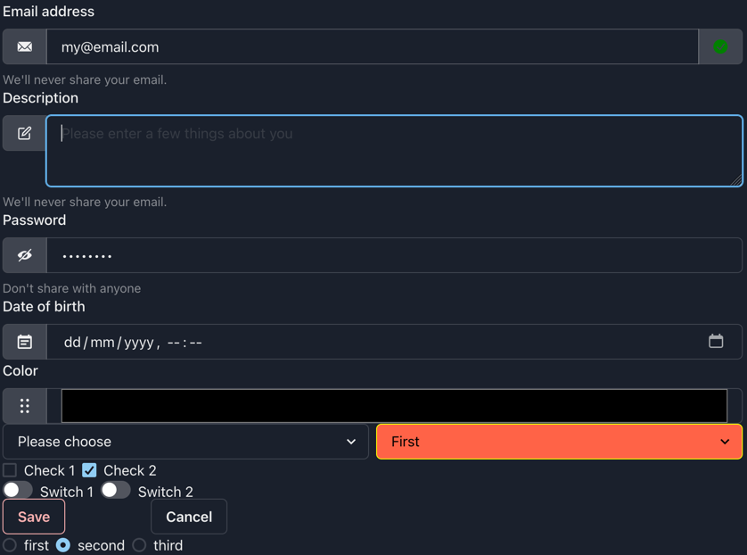

# Chakra components

[The case classes](../terminal21-ui-std/src/main/scala/org/terminal21/client/components/chakra/ChakraElement.scala)

Note: only a fraction of the available properties of each component is documented here.
See the case class for a full list as well as the chakra react documentation (links are available in the scaladocs of each case class).
### Button


```scala
val b = Button(text = "Keep Running")
b.onClick: () =>
    b.text = "Clicked"
    session.render()
```

### Box


```scala
Box(text = "Badges", bg = "green", p = 4, color = "black")
```

## HStack / VStack
Horizontal / Vertical stack of elements


```scala
HStack().withChildren(
  checkbox1,
  checkbox2
)
```

### Menus


```scala
Menu().withChildren(
  MenuButton(text = "Actions menu0001", size = Some("sm"), colorScheme = Some("teal")).withChildren(
    ChevronDownIcon()
  ),
  MenuList().withChildren(
    MenuItem(text = "Download menu-download")
      .onClick: () =>
        box1.text = "'Download' clicked"
        session.render()
    ,
    MenuItem(text = "Copy").onClick: () =>
      box1.text = "'Copy' clicked"
      session.render()
  )
)
```

### Forms

see [Forms](../examples/src/main/scala/tests/chakra/Forms.scala) as an example on how to create forms.



Use FormControl to wrap your form elements:

```scala
FormControl().withChildren(
    FormLabel(text = "Email address"),
    InputGroup().withChildren(
      InputLeftAddon().withChildren(EmailIcon()),
      Input(`type` = "email", value = "my@email.com"),
      InputRightAddon().withChildren(CheckCircleIcon(color = Some("green")))
    ),
    FormHelperText(text = "We'll never share your email.")
)
```

### Editable

Editable is a textarea but looks like normal text until the user clicks it.

```scala
val editable1 = Editable(defaultValue = "Please type here").withChildren(
  EditablePreview(),
  EditableInput()
)

editable1.onChange: newValue =>
  status.text = s"editable1 newValue = $newValue, verify editable1.value = ${editable1.value}"
  session.render()

// Use text area for longer texts
val editable2 = Editable(defaultValue = "For longer maybe-editable texts\nUse an EditableTextarea\nIt uses a textarea control.").withChildren(
  EditablePreview(),
  EditableTextarea()
)

```


### SimpleGrid

```scala
SimpleGrid(spacing = Some("8px"), columns = 4).withChildren(
    Box(text = "One", bg = "yellow", color = "black"),
    Box(text = "Two", bg = "tomato", color = "black"),
    Box(text = "Three", bg = "blue", color = "black")
)
```


### Center / Circle / Square
```scala
Center(text = "Center demo, not styled"),
Center(text = "Center demo center-demo-0001", bg = Some("tomato"), color = Some("white"), w = Some("100px"), h = Some("100px")),
Circle(text = "Circle demo, not styled"),
Circle(text = "Circle demo circle-demo-0001", bg = Some("tomato"), color = Some("white"), w = Some("100px"), h = Some("100px")),
Square(text = "Square demo, not styled"),
Square(text = "Square demo square-demo-0001", bg = Some("tomato"), color = Some("white"), w = Some("100px"), h = Some("100px"))
```


### Image

```scala
Image(
  src = "https://bit.ly/dan-abramov",
  alt = "Dan Abramov",
  boxSize = Some("150px")
),
Image(
  src = "https://bit.ly/dan-abramov",
  alt = "Dan Abramov",
  boxSize = Some("150px"),
  borderRadius = Some("full")
)
```


Images can be hosted in the server under ~/.terminal21:

```shell
 ~/.terminal21  tree
.
└── web
    └── images
        ├── ball.png
        ├── logo1.png
        └── logo2.png
```
and then used like:
```scala
Image(
  src = "/web/images/logo1.png",
  alt = "logo no 1",
  boxSize = Some("150px"),
  borderRadius = Some("full")
)
```