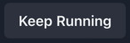

# Chakra components

[The case classes](../terminal21-ui-std/src/main/scala/org/terminal21/client/components/chakra/ChakraElement.scala)

Note: only a fraction of the available properties of each component is documented here.
See the case class for a full list as well as the chakra react documentation (links are available in the scaladocs of each case class).
### Button


```scala
val b = Button(text = "Keep Running")
b.onClick: () =>
    b.text = "Clicked"
    session.render()
```

### Box


```scala
Box(text = "Badges", bg = "green", p = 4, color = "black")
```

## HStack / VStack
Horizontal / Vertical stack of elements


```scala
HStack().withChildren(
  checkbox1,
  checkbox2
)
```

### Menus


```scala
Menu().withChildren(
  MenuButton(text = "Actions menu0001", size = Some("sm"), colorScheme = Some("teal")).withChildren(
    ChevronDownIcon()
  ),
  MenuList().withChildren(
    MenuItem(text = "Download menu-download")
      .onClick: () =>
        box1.text = "'Download' clicked"
        session.render()
    ,
    MenuItem(text = "Copy").onClick: () =>
      box1.text = "'Copy' clicked"
      session.render()
  )
)
```