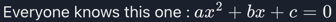

# mathjax


[mathjax](https://docs.mathjax.org/en/latest/), "MathJax is an open-source JavaScript display engine for LaTeX, MathML, and AsciiMath notation ".

terminal21 supports asciimath notation for mathjax version 3.

Dependency: `io.github.kostaskougios::terminal21-mathjax:$VERSION`

### MathJax

Example: [MathJax](../end-to-end-tests/src/main/scala/tests/MathJaxComponents.scala)

```scala
MathJax(
  expression = """Everyone knows this one : \(ax^2 + bx + c = 0\)"""
)
```


see [Writing Mathematics for MathJax](https://docs.mathjax.org/en/latest/basic/mathematics.html)