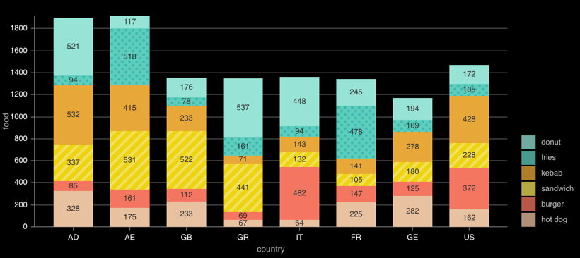

# Nivo

[Nivo](https://nivo.rocks/), "nivo provides a rich set of dataviz components, built on top of D3 and React".

terminal21 supports a few of these, but please add a comment [here](https://github.com/kostaskougios/terminal21-restapi/discussions/3).

### ResponsiveLine

code [ResponsiveLine](../examples/src/main/scala/tests/nivo/ResponsiveLineChart.scala)

### ResponsiveBar

code [ResponsiveBar](../examples/src/main/scala/tests/nivo/ResponsiveBarChart.scala)

