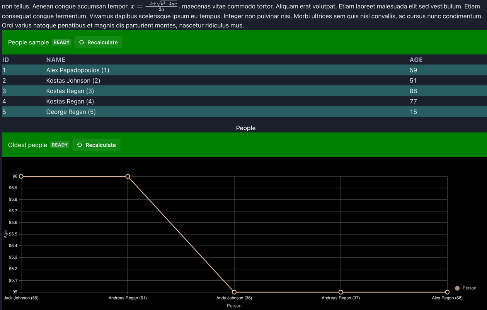
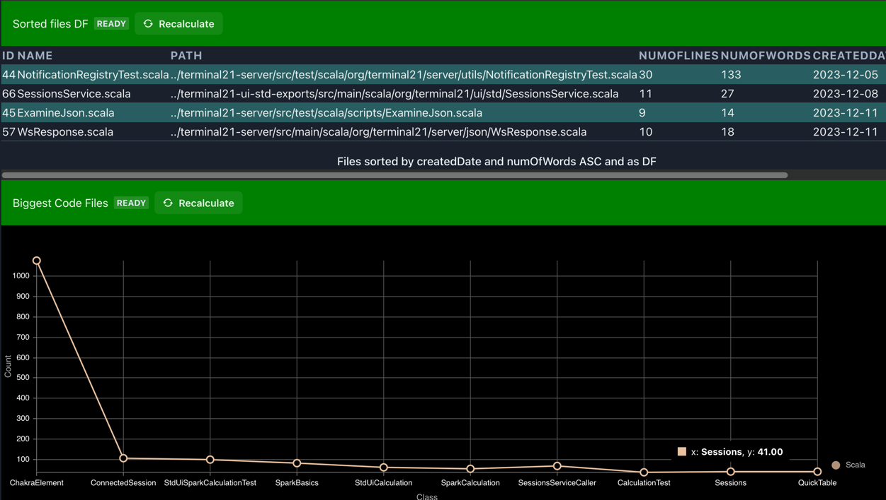

# Spark

Dependency: `io.github.kostaskougios::terminal21-spark:$VERSION`

Terminal 21 spark integration allows using datasets and dataframes inside terminal21 scripts/code.
It also provides caching of datasets in order for scripts to be used as notebooks. The caching
has also a UI component to allow invalidating the cache and re-evaluating the datasets.

To give it a go, please checkout this repo and try the examples. Only requirement to do this is that you have `scala-cli` installed:

```shell
git clone https://github.com/kostaskougios/terminal21-restapi.git
cd terminal21-restapi/example-scripts

# start the server
./server.sc
# ... it will download dependencies & jdk and start the server.

# Now lets run a spark notebook

cd terminal21-restapi/example-spark
./spark-notebook.sc
```

Leave `spark-notebook.sc` running and edit it with your preferred editor. When you save your changes, it will automatically be rerun and
the changes will be reflected in the UI.

## Using terminal21 as notebook with scala-cli

See [spark-notebook.sc](../example-spark/spark-notebook.sc).
On top of the file, `scala-cli` is configured to run with the `--restart` option. This will terminate and restart the script
whenever a change in the file is detected. Edit the script with your favorite IDE and when saving it, it will automatically
re-run. If you want to re-evaluate the datasets, click "Recalculate" on the UI components.



## Using terminal21 as notebook within an ide

Create a scala project (i.e. using sbt), add the terminal21 dependencies and run the terminal21 server. Create your notebook code, i.e.
see [SparkBasics](../terminal21-spark/src/test/scala/org/terminal21/sparklib/endtoend/SparkBasics.scala). Run it. Let it run while
you interact with the UI. Change the code and rerun it. Click "Recalculate" if you want the datasets to be re-evaluated.


