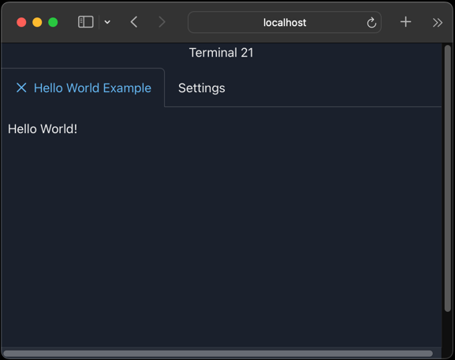
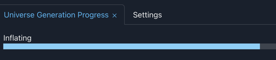
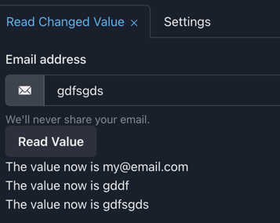

# Terminal21 tutorial

Terminal21 consists of a server and user created scala scripts/apps. The scala scripts contain all the code to create
user interfaces and react to clicks, changed input boxes etc. The terminal21 libraries send the UI's to the server which
in turn renders those as react components (but no js or react coding is required from the user).

For a glimpse on what can be done with terminal21, please have a look at the [terminal21 youtube channel](https://www.youtube.com/@terminal21-gf1oh/videos).

Terminal21 is not meant as a way to create websites. It is rather meant to give UI's to the odd jobs that has to be 
performed by scripts and where it would require a lot of effort to create a dedicated web server with a UI. It is perfect
for scripting for i.e. those internal odd tasks that have to be performed at your workplace or even for things you would
like to do on your box. And you won't have to write a single line of html or javascript.

This tutorial will use `scala-cli` but the same applies for `sbt` or `mill` projects that use the terminal21 libraries.

All example code is under `example-scripts` of this repo, feel free to check the repo and run them.

## Starting the terminal21 server

The easiest way to start the terminal21 server is to have a `scala-cli` script on the box where the server will run.

[server.sc](../example-scripts/server.sc)

```scala
#!/usr/bin/env -S scala-cli

//> using jvm "21"
//> using scala 3
//> using dep io.github.kostaskougios::terminal21-server:0.21

import org.terminal21.server.Terminal21Server

Terminal21Server.start()
```

Now run this with `./server.sc` and the server will start and also print some useful information.

## Creating a folder for our scripts

Create a folder and a file `project.scala` into it. This file will help us include the library dependencies and also
scala & jdk version. It should look like this:

```scala
//> using jvm "21"
//> using scala 3

//> using dep io.github.kostaskougios::terminal21-ui-std:_VERSION_
```

Change `_VERSION_` with the terminal 21 latest version.

See [project.scala](../example-scripts/project.scala)

## Creating a hello world app

To do this we can create a [hello-world.sc](../example-scripts/hello-world.sc) in our folder.

```scala
#!/usr/bin/env -S scala-cli project.scala

import org.terminal21.client.*
import org.terminal21.client.components.*
import org.terminal21.client.components.std.*

Sessions.withNewSession("hello-world", "Hello World Example"): session =>
  given ConnectedSession = session

  Paragraph(text = "Hello World!").render()
  session.leaveSessionOpenAfterExiting()
```

The first line, `#!/usr/bin/env -S scala-cli project.scala`, makes our script runnable from the command line.

```shell
chmod +x hello-world.sc

./hello-world.sc
```

I had issues with intellij and this line, so you may want to comment it out while you develop your scripts.

It starts `scala-cli` and also includes `project.scala` so that we get our dependencies, jdk 21 and scala 3 when running our code.


Next it creates a session. Each session has a unique id (globally unique across scripts), in this case `hello-world`. And a session
title, "Hello World Example", that will be displayed on the browser.

```scala
Sessions.withNewSession("hello-world", "Hello World Example"): session =>
  ...
```



Next is the actual user interface, in this example just a paragraph with a "Hello World!":

```scala
Paragraph(text = "Hello World!").render()
```

The `render()` method sends the UI to the server which in turn sends it to the terminal21 UI so that it is rendered.

Finally because this is just a presentation script (we don't expect any feedback from the user), we can terminate it but
inform terminal21 we want to leave the session open so that the user has a chance to see it.

```scala
session.leaveSessionOpenAfterExiting()
```

When we run our code, it will compile, download dependencies (if needed) and run. It will exit straight away but the UI for our script
will be available in terminal21 UI.

## Updating the UI

Let's create a script that will display a progress bar for some process that will run for some time. The script will update
the progress bar and also give an informative message regarding which stage of the process it is performing.

[progress.sc](../example-scripts/progress.sc)



```scala
#!/usr/bin/env -S scala-cli project.scala

import org.terminal21.client.*
import org.terminal21.client.components.*
import org.terminal21.client.components.std.*
import org.terminal21.client.components.chakra.*

Sessions.withNewSession("universe-generation", "Universe Generation Progress"): session =>
  given ConnectedSession = session

  val msg = Paragraph(text = "Generating universe ...")
  val progress = Progress(value = 1)

  Seq(msg, progress).render()

  for i <- 1 to 100 do
    val p = progress.withValue(i)
    val m =
      if i < 10 then msg
      else if i < 30 then msg.withText("Creating atoms")
      else if i < 50 then msg.withText("Big bang!")
      else if i < 80 then msg.withText("Inflating")
      else msg.withText("Life evolution")

    Seq(p, m).renderChanges()
    Thread.sleep(100)

  // clear UI
  session.clear()
  Paragraph(text = "Universe ready!").render()
```

Here we create a paragraph and a progress bar.

```scala
  val msg = Paragraph(text = "Generating universe ...")
  val progress = Progress(value = 1)
```

Then we render them for the first time on screen. When we want to add a new element to the UI, we use the `render()` method. When
we want to update an existing element we use the `renderChanges()` method.

```scala
  Seq(msg, progress).render()
```

Then we have our main loop where the calculations occur. We just use a `Thread.sleep` to simulate that some important task is being calculated. And we
update the progress bar and the message in our paragraph.
```scala
val p = progress.withValue(i)
val m = ... msg.withText("Creating atoms") ...
```

Note the `e.withX()` methods. Those help us change a value on a UI element. We get a copy of the UI element which we can render as an update:

```scala
Seq(p, m).renderChanges()
```

Finally, when the universe is ready, we just clear the UI and render a paragraph before we exit.

```scala
session.clear()
Paragraph(text = "Universe ready!").render()
```
## Handling clicks

Some UI elements allow us to attach an `onClick` handler. When the user clicks the element, our scala code runs.

Let's see for example [on-click.sc](../example-scripts/on-click.sc). We will create a paragraph and a button. When the
user clicks the button, the paragraph text will change and the script will exit.

```scala
#!/usr/bin/env -S scala-cli project.scala

import org.terminal21.client.*
import org.terminal21.client.components.*
import org.terminal21.client.components.std.*
import org.terminal21.client.components.chakra.*

Sessions.withNewSession("on-click-example", "On Click Handler"): session =>
  given ConnectedSession = session

  @volatile var exit = false
  val msg = Paragraph(text = "Waiting for user to click the button")
  val button = Button(text = "Please click me").onClick: () =>
    msg.withText("Button clicked.").renderChanges()
    exit = true

  Seq(msg, button).render()

  session.waitTillUserClosesSessionOr(exit)
```

First we create the paragraph and button. We attach an `onClick` handler on the button:

```scala
  val button = Button(text = "Please click me").onClick: () =>
    msg.withText("Button clicked.").renderChanges()
    exit = true
```
Here we change the paragraph text and also update `exit` to `true`.

Our script waits until var `exit` becomes true and then terminates.

```scala
session.waitTillUserClosesSessionOr(exit)
```

Now if we run it with `./on-click.sc` and click the button, the script will terminate.

## Reading updated values

Some UI element values, like input boxes, can be changed by the user. We can read the changed value at any point of our
code or install an onChange handler so that we read the value as soon as the user changes it.

Let's see how we can just read the value. The following script will create an email input box and a button. Whenever
the button is pressed, it will read the email and create a new paragraph with the email value.

[read-changed-value.sc](../example-scripts/read-changed-value.sc)



```scala
#!/usr/bin/env -S scala-cli project.scala

import org.terminal21.client.*
import org.terminal21.client.components.*
import org.terminal21.client.components.std.Paragraph
import org.terminal21.client.components.chakra.*

Sessions.withNewSession("read-changed-value-example", "Read Changed Value"): session =>
  given ConnectedSession = session

  val email = Input(`type` = "email", value = "my@email.com")
  val output = Box()

  Seq(
    FormControl().withChildren(
      FormLabel(text = "Email address"),
      InputGroup().withChildren(
        InputLeftAddon().withChildren(EmailIcon()),
        email
      ),
      FormHelperText(text = "We'll never share your email.")
    ),
    Button(text = "Read Value").onClick: () =>
      val value = email.current.value
      output.current.addChildren(Paragraph(text = s"The value now is $value")).renderChanges()
    ,
    output
  ).render()

  session.waitTillUserClosesSession()
```

The important bit is this:

```scala
    Button(text = "Read Value").onClick: () =>
      val value = email.current.value
      output.current.addChildren(Paragraph(text = s"The value now is $value")).renderChanges()
```

When the button is clicked, we get the current state of the `email` input box via `email.current`. And then get it's value, `email.current.value`.

Also in order to append a new paragraph to the `output`, we get the current state of it (which includes any previous paragraphs we have added) and then
add a paragraph as a new child. Then we render the changes of `output` which includes the paragraphs.

We can now give it a try: `./read-changed-value.sc`

We can also add an `onChange` event handler on our input box and get the value whenever the user changes it.

[on-change.sc](../example-scripts/on-change.sc)

```scala
#!/usr/bin/env -S scala-cli project.scala

import org.terminal21.client.*
import org.terminal21.client.components.*
import org.terminal21.client.components.std.Paragraph
import org.terminal21.client.components.chakra.*

Sessions.withNewSession("on-change-example", "On Change event handler"): session =>
  given ConnectedSession = session

  val output = Paragraph(text = "Please modify the email.")
  val email = Input(`type` = "email", value = "my@email.com").onChange: v =>
    output.withText(s"Email value : $v").renderChanges()

  Seq(
    FormControl().withChildren(
      FormLabel(text = "Email address"),
      InputGroup().withChildren(
        InputLeftAddon().withChildren(EmailIcon()),
        email
      ),
      FormHelperText(text = "We'll never share your email.")
    ),
    output
  ).render()

  session.waitTillUserClosesSession()
```

The important bit are these lines:

```scala
  val output = Paragraph(text = "Please modify the email.")
  val email = Input(`type` = "email", value = "my@email.com").onChange: v =>
    output.withText(s"Email value : $v").renderChanges()
```

For the `Input` box, we add an `onChange` handler that gets the new value as `v`. We then use the value to update the paragraph.

This script can be run as `./on-change.sc`.
